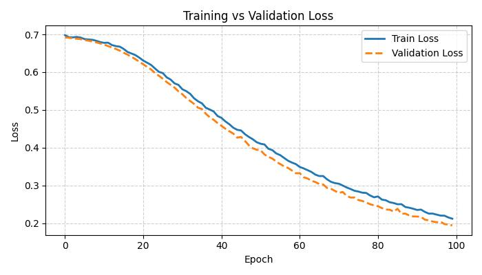
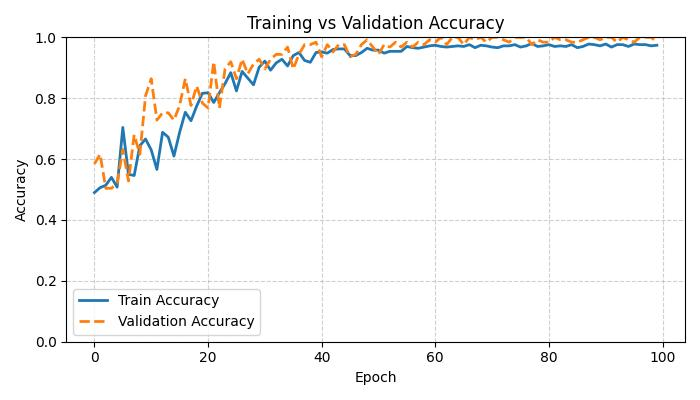
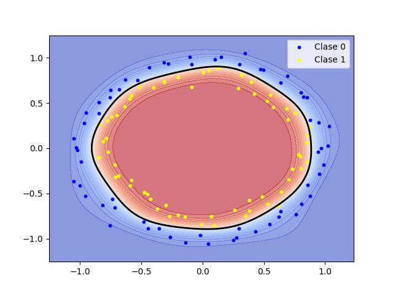

# 2D Non-Linear Classification with a Minimal MLP (PyTorch)

A small but complete project to explore **non-linear 2D classification** using a **minimalist MLP** in PyTorch.
It includes training infrastructure, metric logging, run management and automatic visualization.

The goal is to understand and analyze:

* decision boundary shapes,
* loss/accuracy evolution,
* real effects of L2 regularization (weight decay),
* how to structure a clean ML mini-project.

---

## 🚀 Running an Experiment

```bash
python main.py --epochs 100 --batch-size 32 --lr 0.01 --weight-decay 0.0
```

Useful arguments:

* `--epochs`: number of epochs
* `--batch-size`: batch size
* `--lr`: learning rate
* `--weight-decay`: L2 regularization strength
* `--eval-only`: evaluate an existing checkpoint
* `--ckpt-path`: checkpoint path

Every run automatically creates a folder inside `runs/` containing:

* the metrics CSV,
* figures (`loss.png`, `acc.png`, `boundary.png`),
* the model checkpoint.

---

## 🧠 Model Architecture

The project uses a deliberately simple MLP:

* 1 hidden layer
* `Tanh` activation
* Output in logits (for `BCEWithLogitsLoss`)

Designed this way **on purpose**, to make decision boundaries easy to interpret.

---

## 📊 Example Outputs

Each run produces three key figures:

* `loss.jpg` — loss curve
* `acc.jpg` — accuracy curve
* `boundary.jpg` — 2D decision boundary





---

## 🧪 Experiment: Effect of Weight Decay

Two runs are included:

### 🔹 WD = 0.0 (no regularization)

* The model perfectly learns the circular structure.
* Train/val accuracy ≈ 99%.
* Smooth, correct decision boundary.
* No meaningful overfitting is present.

### 🔹 WD = 0.005 (heavy regularization)

* The regularization term dominates the loss.
* The model barely moves away from initialization.
* Accuracy ≈ 50% (random).
* Decision boundary collapses to a trivial separator.

### 📌 Conclusion

For this simple dataset, a small MLP *already generalizes extremely well*.
Adding weight decay **does not improve** performance, and strong regularization can **completely prevent learning**.

This shows the **bias–variance trade-off** clearly.

---

## 🧪 Possible Extensions

* Add more layers or different activations (ReLU, GELU)
* Increase dataset noise to observe real overfitting
* Compare dropout vs weight decay
* Try Xavier / Kaiming initialization
* Compare MLP vs Logistic Regression vs SVM
* Perform a small hyperparameter grid search


